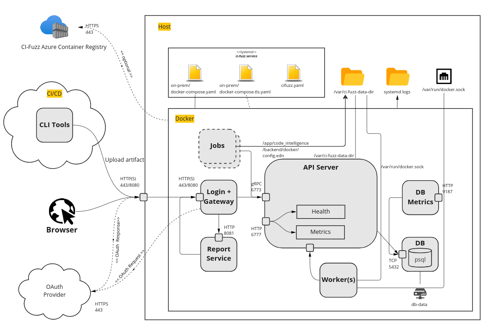

# **CI Fuzz** 

<!---->

## CI Fuzz Architecture

## Included Components

A CI Fuzz installation consists of several components.

### Backend API server

The main backend server offers a gRPC API which allows clients to set up fuzzing projects, start / monitor / stop fuzzers, inspect findings and much more. Additionally, the gRPC API is automatically converted to a REST API using a grpc gateway which allows for easier integration of the API in a JavaScript environment.

### Database

A Postgres database is used to persist fuzzing results and user data. The database configured in the included docker-compose setup works out of the box, however, it is also possible to connect to an already configured Postgres database.

### Gateway

The gateway service serves as a reverse proxy for all other components and is the single entry point for the CI Fuzz backend. It also hosts the Web App, does TLS termination and handles the OAuth flow.

### Reporting

The reporting service uses the API to generate reports in pdf, docx and xlsx format.

### Worker

The worker runs and monitors jobs are created by the API server. The most common job is the execution of a fuzzer and the evaluation of line coverage. All jobs are currently run inside Docker containers which are spawned alongside the docker-compose setup (Docker out of Docker).

The API Server is configured to start 4 worker instances by default.

### Web App

A single page web app which can be accessed to configure fuzzing projects, monitor fuzzer execution and get detailed information on findings that were detected by fuzzers. This is hosted by the Gateway container.

### Command Line Client

The installation also includes a command line client named `cictl`. It communicates with the API server via gRPC and can be used to start fuzzing jobs from CI/CD pipelines and other common tasks involving the CI Fuzz backend API.
