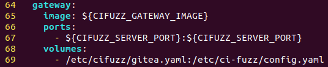

# Custom OIDC Provider

### Set up login via an OpenID Connect (OIDC) provider

[OpenID Connect Core spec](https://openid.net/specs/openid-connect-core-1\_0.html)

### **Create an OIDC-capable application**

In the OIDC provider, create an OIDC-capable application with:

* Redirect URL: \<baseURL>/auth/\<provider>/callback, where:
  * \<baseURL> is the URL that the CI Fuzz web app is available at, for\
    example https://cifuzz.example.com.
  * \<provider> is a name of your choice, that will be used for this OIDC provider in the CI Fuzz web app.
* If configurable at the provider, permissions that allow reading user profile information, like the name and email address, via OIDC.


Take note of the application's client ID and client secret, you will need those below.


### **Configure CI Fuzz Server**

If the OIDC provider implements the [OpenID Connect Discovery spec](https://openid.net/specs/openid-connect-discovery-1\_0.html) (i.e. a JSON document exists at .well-known/openid-configuration), the setup is simpler. In that case, create a .yaml file in /etc/cifuzz. It can be named anything (e.g. gitea.yaml).

```yaml
auth:
  oidc:
    <provider>:
      id: <client ID>
      secret: <client secret>
      issuer_url: <issuer URL>
```

Where:

* \<provider> is the name for the OIDC provider you chose above.
* \<client ID> and \<client secret> are the client ID and secret of the application you created above.
* \<issuer URL> is the base URL of the OIDC provider, for example https://gitlab.com.

If the OIDC provider does not support OpenID Connect Discovery, add these settings to the configuration file instead:

```yaml
auth:
  oidc:
    <provider>:
      id: <client ID>
      secret: <client secret>
      auth_endpoint: <auth endpoint URL>
      token_endpoint: <token endpoint URL>
      userinfo_endpoint: <UserInfo endpoint URL>
      jwks_url: <JWKS URL>
```

Where:

* \<provider> is the name for the OIDC provider you chose above.
* \<client ID> and \<client secret> are the client ID and secret of the application you created above.
* \<auth endpoint URL> is the URL of the authorization endpoint of the OIDC provider, for example https://gitlab.com/oauth/authorize.
* \<token endpoint URL> is the URL of the token endpoint of the OIDC provider, for example https://gitlab.com/oauth/token.
* \<UserInfo endpoint URL> is the URL of the UserInfo endpoint of the  OIDC provider, for example https://gitlab.com/oauth/userinfo.
  * This setting is optional. If no UserInfo endpoint is specified, only the Claims of the ID Token will be used.
* \<JWKS URL> is the URL of the OIDC provider's JSON Web Key Set document, for example https://gitlab.com/oauth/discovery/keys.

### Update docker-compose.yaml

The last step is to inform the gateway container of the .yaml file you created. To do this, modify the docker-compose.yaml file in the cifuzz installation directory (default location: /opt/ci-fuzz-\<version>) to make the gateway mount the yaml file you created.&#x20;

From the screenshot below, add the last two lines (68 and 69) to your docker-compose.yaml file (or just the last line if volumes: already exists).&#x20;


**W**hen mounting your .yaml file, it should be mounted to /etc/ci-fuzz/config.yaml.



